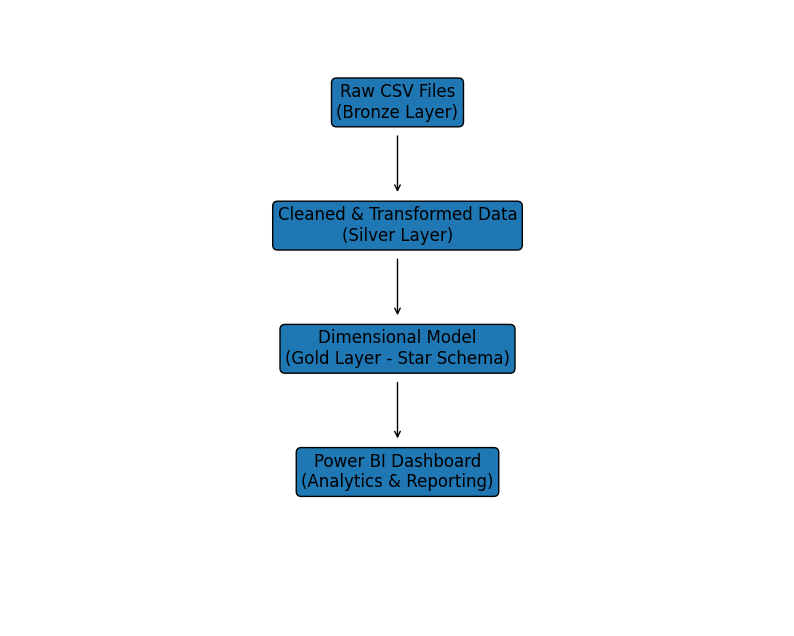

# Healthcare-Claims-Data-Engineering
This project implements an end-to-end data engineering solution in Microsoft Fabric to process and analyze healthcare insurance claims. Using a Medallion Architecture, the pipeline transforms raw, unstructured claim files into a refined dimensional model, enabling stakeholders to track financial performance, and claim denial patterns.

## Architecture

 ## Tech Stack

| Category | Technology Used |
|----------|-----------------|
| Cloud Platform | Microsoft Fabric |
| Storage | Lakehouse (Delta Tables) |
| Data Processing | PySpark (Spark SQL) |
| Data Transformation | Dataflows Gen2 |
| Architecture | Medallion (Bronze / Silver / Gold) |
| Data Modeling | Snowflake Schema (Fact & Dimension Tables) |
| BI & Visualization | Power BI |
| Version Control | Git & GitHub |

## Business Impact

This solution provides measurable value for healthcare operations:

- Reduced manual reporting effort by enabling automated data pipelines.
- Improved financial visibility through claim approval and payment tracking.
- Identified high denial-rate providers to support operational improvement.
- Enabled trend analysis of claims over time for strategic decision-making.
- Structured raw, unorganized claim data into an analytics-ready model.

This architecture simulates a real-world enterprise healthcare analytics solution.
